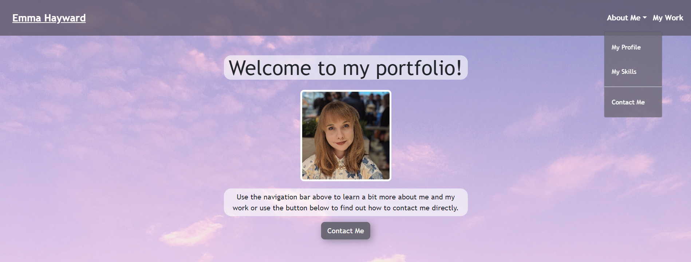
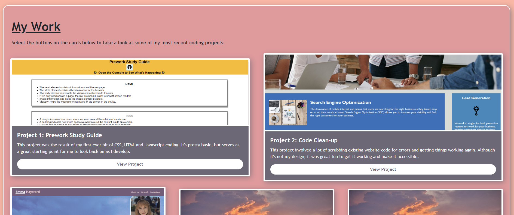
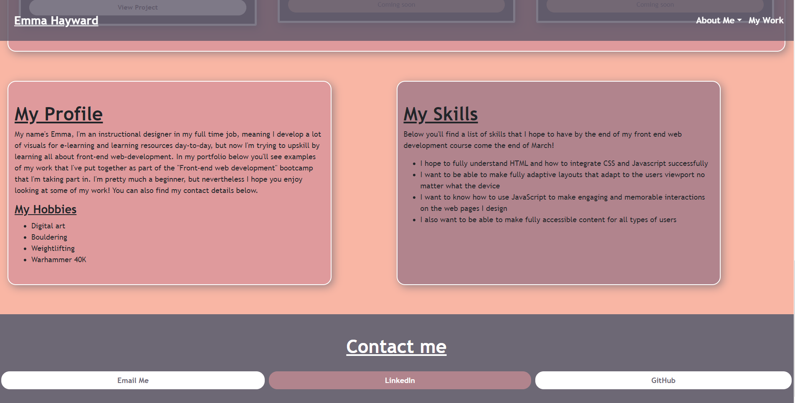

# Bootstrap-Portfolio
#

## Description

For this project I wanted to try and recreate a previous project of mine - which can be found under the repo "EmmaH-Portfolio" and the final product of that project can be viewed here: https://emh93.github.io/EmmaH-Portfolio/ 

In order to "upgrade" the project I wanted to utilise Bootstrap v4 components to make a more fluid layout and to see if I could make an adaptive web page without the use of media queries (thanks to bootstrap's styling). I found this project much easier than the previous project's build - maybe because I had a design in mind this time, and obviously because of the ready made components at my disposal.

Hopefully this new portfolio can serve as another more advanced iteration of my first portfolio and will continue to allow me to display my work publicly. 

I found using the pre-existing classes difficult at times, and found a good amount of use in the "!important" CSS tag, which helped me to override stubborn theming.

## Installation

My project is currently one web page based in a html index file and css style sheet, with a folder for images. Cloning this repository will allow visitors to have a closer look at the code, but the page can also be viewed in full here:

## Usage

The page can be accessed via the url shown above. Now we'll look at the sections of the portfolio and how to navigate the page. The page is split into 6 distinct sections:

1. Navigation Bar
2. Hero/Jumbotron page header
3. My Work
4. My Profile
5. My Skills
6. My Contact Details

We'll explore them in more detail now:

Navigation bar and Jumbotron page header

In the above image you can see the top of the page and page header image. The navigation bar has a fixed positioning so will follow the user as they scroll down the page. Selecting any of the items on the navbar or in the dropdown menu will take the user to the appropriate section on the page. The page header also contains a button that encourages the user to get in contact with the author by taking them straight to their contact details.

My Work

The next section contains a grid of cards with each containing an image, description of and link to some of my launched applications. There are two cards that have inactive buttons as they are "coming soon" soon to be used cards for future projects.

My Profile, My Skills and My Contact Details

The final half of the page contains my user profile and hobbies, as well as a list of skills that I hope to obtain over the course of my front-end web development bootcamp that I am currently taking part in. For the footer of the page we can see three hyperlinks to various ways users can contact me, with the email link opening their email app upon clicking.

## Credits

Navigation bar, Jumbotron, cards and footer button components taken from Bootstrap v4 https://getbootstrap.com/ 

Stock images taken from pexels https://www.pexels.com/ 

## License

MIT license